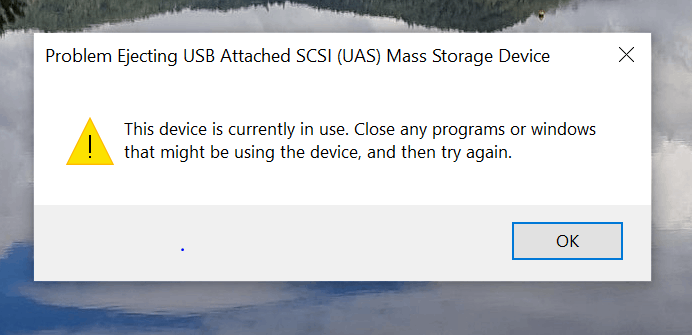
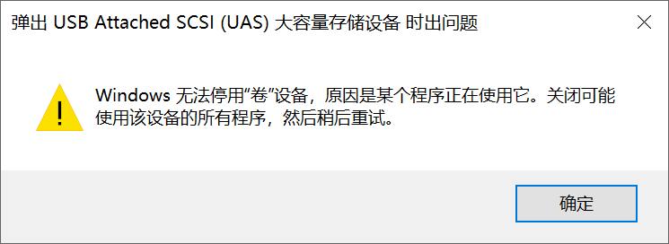

# How To Eject Portable Drive Stuck On Windows

A bugged portable drive cannot be ejected, despite there is no actual application using it. However, there is a way to quickly eject your drive without shutting down your PC.

When this happens, you get "Problem Ejecting USB ... Storage Device" error

 

- **Image Source:** [learn.microsoft.com](https://learn.microsoft.com/en-us/answers/questions/4095494/error-message-another-problem-ejecting-usb-attache)

## Steps

1. Make sure there actually is no application using your disk
  - Check if there is an application stopped ejection: Event Viewer → Custom Views → Administrative Events
2. Put this drive to "Offline" in Device Manager → Disk Management
  - Note that this step can be disruptive, make sure there really isn't any application using this drive
3. Put this drive back to "Online" in the same way
4. Now you can eject this drive normally

- **Image Source:** [eightforums.com](https://www.eightforums.com/threads/disk-set-as-offline-or-online.53106/)
